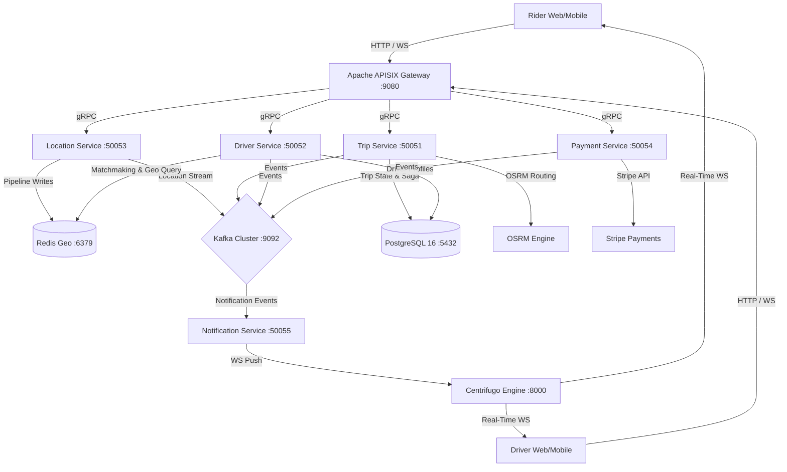

# UrbanPrime 🚕

> A production-grade, distributed microservices platform engineered for real-time ride-hailing and matchmaking at scale.

[](https://go.dev/)
[](LICENSE)
[](CONTRIBUTING.md)

## Scale Targets
- **100,000+** Active Concurrent Users & Drivers
- **33,333+** GPS pings/second ingested
- **< 1ms** Spatial search latency for nearest-driver matchmaking
- **50,000+** RPS handled by the API Gateway

## System Architecture



## Tech Stack Overview

| Component | Technology | Why? (Technical Decision) |
| :--- | :--- | :--- |
| **Core Languages** | Go 1.22 | Chosen for its predictable low-latency GC, highly efficient concurrency primitives (goroutines), and robust gRPC ecosystem. Essential for high-throughput I/O services. |
| **API Gateway** | Apache APISIX | Built on LuaJIT and Nginx. Handles 50k+ RPS per node with Redis-backed leaky bucket rate limiting to protect internal gRPC services from surges. |
| **Primary Datastore** | PostgreSQL 16 | ACID compliance is mandatory for payment states and trip state machines. Uses `pgxpool` for connection pooling to prevent thread pool exhaustion. |
| **Spatial Index & Cache** | Redis 7 | Used for `GEOADD` and `GEOSEARCH` in-memory operations. Sub-millisecond latency is critical; SQL spatial joins (`ST_DWithin`) are too slow under massive concurrent load. |
| **Event Bus** | Apache Kafka | Decouples trip lifecycles and handles the firehose of driver GPS locations. Prevents slow consumers (e.g. websockets) from blocking core business logic. |
| **Real-time WebSockets** | Centrifugo v5 | Offloads the responsibility of holding 100k+ idle/active TCP connections from our Go business logic. Subscribes to Kafka and pushes JSON over WS. |
| **RPC Framework** | gRPC (Protobuf) | Provides strongly typed contracts and uses HTTP/2 multiplexing, reducing connection overhead between internal microservices. |
| **Tracing** | OpenTelemetry + Jaeger | Distributed tracing across boundaries. Essential for debugging timeouts in complex Saga orchestration flows. |

## Microservices Breakdown

### 1. Trip Service (Saga Orchestrator)
**What it does:** Manages the entire lifecycle of a ride (Creation, Matching, Ongoing, Completed, Cancelled). Calculates fares and routing via OSRM. 
**Key Decisions:**
- Uses the **Saga Pattern** for distributed transactions. A trip creation requires a payment hold, driver match, and notification. If any step fails, compensating transactions are fired in reverse order to rollback state.
- Trip states are persisted in PostgreSQL with a `JSONB saga_log` column to provide an append-only audit trail of state transitions for debugging stalled trips.

### 2. Driver Service (Matchmaking Engine)
**What it does:** Maintains driver profiles and executes the matchmaking loop (Radius Search -> Offer -> Accept/Decline/Timeout -> Fallback).
**Key Decisions:**
- Resolves race conditions using **Atomic Redis Distributed Locks (`SetNX`)**. This prevents the system from offering the same highly-rated, nearby driver to multiple riders simultaneously during traffic surges.
- Matchmaking is an asynchronous dispatch loop that emits Kafka events (`MatchOffered`, `MatchAccepted`, `MatchExhausted`) rather than holding a synchronous gRPC call open for 15+ seconds while waiting for human input.

### 3. Location Service (GPS Firehose)
**What it does:** Ingests high-frequency GPS coordinates from active drivers.
**Key Decisions:**
- **Zero Database Writes:** At 33,333 pings/sec, updating a relational database is an anti-pattern. This service writes directly to a Redis Geo pipeline and publishes to Kafka.
- Employs Redis TTLs on driver locations so offline drivers naturally age out of the spatial index without requiring explicit cleanup routines.

### 4. Payment Service
**What it does:** Integrates with Stripe for authorization holds and captures.
**Key Decisions:**
- Idempotency is strictly enforced using unique constraint keys in PostgreSQL based on the `trip_id` and `action`. This guarantees that retried Kafka messages during network partitions do not result in double-charging a rider.

### 5. Notification Service
**What it does:** Bridges backend Kafka events to frontend clients.
**Key Decisions:**
- Contains no business logic. It strictly consumes `trip.events.v1` and `driver.location.v1` from Kafka and formats them into Centrifugo HTTP Publish API calls. By keeping it dumb, we can scale it horizontally strictly based on Kafka lag.

### 6. Auth Service
**What it does:** Issues and validates JWTs for riders and drivers.
**Key Decisions:**
- Uses stateless short-lived asymmetric JWTs (Access Tokens) validated at the APISIX gateway level, removing the need for internal microservices to constantly query a central auth database.

## Scalability Deep-Dive

We engineered the system to bypass traditional bottlenecks found in standard CRUD applications.

| Bottleneck / Challenge | Architectural Solution | Performance Impact |
| :--- | :--- | :--- |
| **GPS Location Firehose** (33,333 pings/sec) | Ingest pings via **Go Location Service** straight to **Redis Geo in-memory pipeline** + async Kafka stream. **No DB writes**. | Reduces database I/O to zero for location pings. Write latency ~1-2ms. |
| **Nearest Driver Search** (Concurrent) | **Redis `GEOSEARCH`** radius queries instead of heavy SQL spatial joins (`ST_DWithin`). | Sub-millisecond spatial search vs 100ms+ SQL join queries. |
| **Database Connection Overload** | **PostgreSQL Connection Pooling (`pgxpool`)** + prepared statement caching + short transactions. | Prevents thread pool exhaustion under heavy concurrent load spikes. |
| **Race Conditions in Matching** | **Atomic Redis Distributed Locks (`SetNX`)** during driver offer dispatch. | Prevents offering the same driver to multiple riders simultaneously. |
| **Real-time Map Updates** | **Centrifugo WebSocket Hub** handles 100k+ concurrent WS connections. | Keeps Go microservices decoupled from maintaining persistent WebSockets. |

## Local Development Setup

We use Docker Compose to spin up the entire infrastructure and microservice mesh locally.

1. Ensure you have Docker and Docker Compose installed.
2. Copy the environment template:
   ```bash
   cp .env.example .env
   ```
3. Start the infrastructure and backend services:
   ```bash
   docker compose --profile full up -d
   ```
4. Verify services are healthy:
   ```bash
   docker compose ps
   ```

## API Reference (gRPC)

Communication between services strictly enforces the gRPC protocol defined in our `.proto` files.

**Trip Service (`proto/trip/v1/trip.proto`)**
- `CreateTrip(CreateTripRequest) returns (CreateTripResponse)`
- `GetTrip(GetTripRequest) returns (GetTripResponse)`
- `CancelTrip(CancelTripRequest) returns (CancelTripResponse)`

**Driver Service (`proto/driver/v1/driver.proto`)**
- `MatchDriver(MatchDriverRequest) returns (MatchDriverResponse)`
- `UpdateDriverStatus(UpdateDriverStatusRequest) returns (UpdateDriverStatusResponse)`

**Location Service (`proto/location/v1/location.proto`)**
- `UpdateLocation(UpdateLocationRequest) returns (UpdateLocationResponse)`
- `GetNearbyDrivers(GetNearbyDriversRequest) returns (GetNearbyDriversResponse)`

**Payment Service (`proto/payment/v1/payment.proto`)**
- `AuthorizeHold(AuthorizeHoldRequest) returns (AuthorizeHoldResponse)`
- `ReleaseHold(ReleaseHoldRequest) returns (ReleaseHoldResponse)`
- `CapturePayment(CapturePaymentRequest) returns (CapturePaymentResponse)`

## Observability & Tracing

Distributed systems fail in distributed ways. We utilize OpenTelemetry (OTel) for standardized trace propagation.
- **Trace Context** is passed across gRPC boundaries using OTel interceptors.
- **Kafka Headers** carry span IDs to bridge synchronous gRPC calls with asynchronous event processing.
- You can view full trace waterfalls locally via the Jaeger UI on `http://localhost:16686`.

## Project Structure

```text
.
├── Services/
│   ├── auth-service/         # JWT issuance and validation
│   ├── driver-service/       # Matchmaking and dispatch loop
│   ├── location-service/     # High-throughput GPS ingestion
│   ├── notification-service/ # Kafka to WebSocket bridge
│   ├── payment-service/      # Stripe integration and ledger
│   └── trip-service/         # Saga orchestration and state machine
├── deploy/
│   ├── apisix/               # API Gateway configuration
│   ├── centrifugo/           # WebSocket engine configuration
│   └── docker-compose.yml    # Local cluster orchestration
├── frontend/                 # Next.js web application
├── pkg/                      # Shared Go libraries (logging, tracing)
├── proto/                    # Protocol Buffer definitions
└── scripts/                  # CI/CD and DB migration scripts
```
