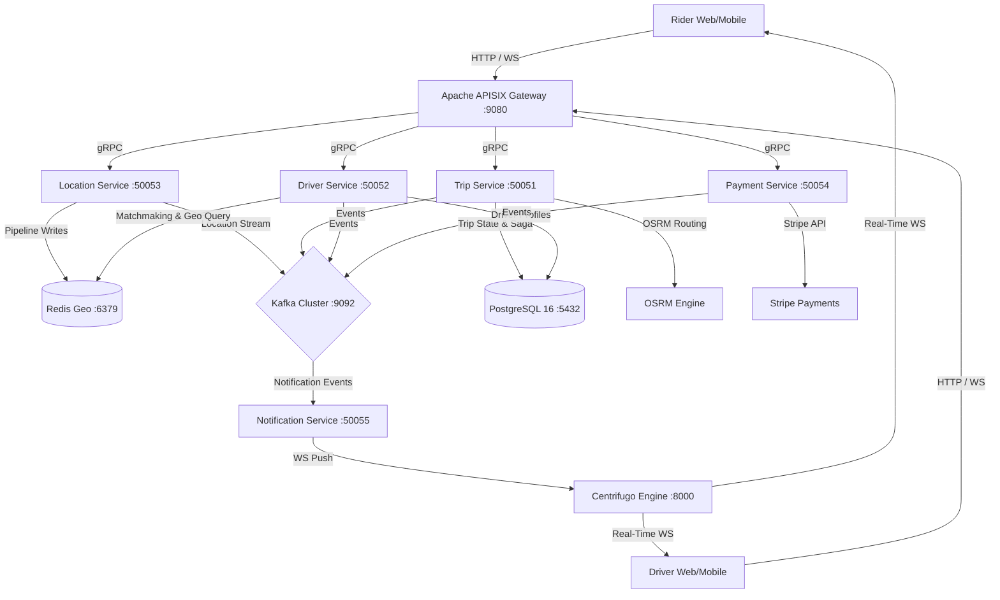

# Real-Time Cab Booking Platform — Architecture & Scalability Design

A production-grade, distributed microservices platform built in **Go 1.22**, engineered to scale to **100,000+ active concurrent users and drivers** (~33,000+ GPS location updates per second).

---

## 1. 100k Concurrent Users Scalability Blueprint

```
 100k Active Drivers (3s GPS pings) ──► Location Service (Go) ──► Redis Geo (In-Memory Pipeline)
                                                               └──► Kafka (Async Batch Stream)

 100k Active Riders (Ride Requests) ──► APISIX Gateway ──► Trip Service (Saga Orchestrator)
                                                               └──► Driver Service (Redis GEOSEARCH)
```

### High-Scalability Architectural Pillars:

| Bottleneck / Challenge | Architectural Solution | Performance Impact |
| :--- | :--- | :--- |
| **GPS Location Firehose**<br>(33,333 pings/sec from 100k drivers) | Ingest pings via **Go Location Service** straight to **Redis Geo in-memory pipeline (`GEOADD`)** + async Kafka event stream. **No direct DB writes!** | Reduces database I/O to zero for location pings. Sub-millisecond write latency (~1-2ms). |
| **Nearest Driver Search**<br>(Thousands of riders searching concurrently) | **Redis `GEOSEARCH`** radius queries instead of heavy SQL spatial joins (`ST_DWithin`). | Sub-millisecond spatial search vs 100ms+ SQL join queries. |
| **Database Connection Overload** | **PostgreSQL Connection Pooling (`pgxpool`)** + prepared statement caching + short read/write transactions. | Prevents thread pool exhaustion under heavy concurrent load spikes. |
| **Race Conditions in Matching** | **Atomic Redis Distributed Locks (`SetNX`)** during driver offer dispatch. | Prevents offering the same driver to multiple riders simultaneously. |
| **Real-time Map Updates** | **Centrifugo WebSocket Hub** (subscribes to Redis/Kafka, handles 100k+ concurrent WS client connections per node). | Keeps microservices decoupled from maintaining persistent WebSocket connections. |
| **API Gateway Throttling** | **Apache APISIX** (LuaJIT engine handling 50k+ RPS per node with Redis-backed leaky bucket rate limiting). | Protects internal gRPC microservices from traffic surges. |

---

## 2. Microservice Topology & Communication Flow



---

## 3. Implemented Microservices

### 1. Trip Service (`Services/trip-service/`)
- **Port**: `:50051` (gRPC)
- **Database**: PostgreSQL (`trips` table with `JSONB saga_log` column for auditability)
- **Migrations**: `golang-migrate` SQL migrations in `Services/trip-service/migrations/`
- **Routing Engine**: OSRM API Client querying `/route/v1/driving` with Haversine geometric fallback
- **Fare Calculator**: Uber-model `(BaseFare + (PerKmRate * Km) + (PerMinRate * Min)) * SurgeMultiplier`
- **Saga Orchestrator**: Executes `CreateTrip` saga steps with compensating rollback capabilities
- **Kafka Producer**: Publishes events to `trip.events.v1` (`TripCreated`, `TripMatchingStarted`, `TripCancelled`)

### 2. Driver Service (`Services/driver-service/`)
- **Port**: `:50052` (gRPC)
- **Database**: PostgreSQL (`drivers` table for profiles & status)
- **Spatial Engine**: Redis Geo in-memory spatial index (`GEOADD`, `GEOSEARCH` radius queries, `ZREM`)
- **Dispatch Loop**: Uber/Bolt matchmaking engine (nearest-driver search -> atomic Redis `SetNX` distributed lock -> Kafka `MatchOffered` -> 15s timeout -> fallback to next nearest candidate -> `MatchExhausted`)
- **Kafka Producer**: Publishes events to `driver.match.v1` (`MatchOffered`, `MatchAccepted`, `MatchDeclined`, `MatchExhausted`)

---

## 4. Microservices Infrastructure & Ports

| Component | Port | High Scale Responsibility |
| :--- | :--- | :--- |
| **Apache APISIX** | `9080` (Proxy), `9090` (Control) | High-throughput API Gateway (JWT Auth, Distributed Rate Limiting) |
| **PostgreSQL 16** | `5432` | Relational datastore for Trips, Drivers, Payments |
| **Redis 7** | `6379` | In-memory spatial index (`GEOADD` / `GEOSEARCH`) + Session cache |
| **Apache Kafka** | `9092` / `29092` | High-throughput event streaming bus (driver locations & trip events) |
| **Centrifugo v5** | `8000` | Scalable WebSocket engine handling 100k+ concurrent client channels |
| **Jaeger OTel** | `16686` (UI), `4317` (OTLP) | OpenTelemetry distributed tracing across all microservices |
| **Trip Service** | `50051` | gRPC service (Saga Orchestrator & State Machine) |
| **Driver Service** | `50052` | gRPC service (Fast Redis Geo Matchmaking algorithm & Dispatch Loop) |
| **Location Service** | `50053` | gRPC service (High-speed GPS Ingestion Firehose) |
| **Payment Service** | `50054` | gRPC service (Stripe payment holds & compensations) |
| **Notification Service** | `50055` | gRPC service (Centrifugo WS bridge) |
