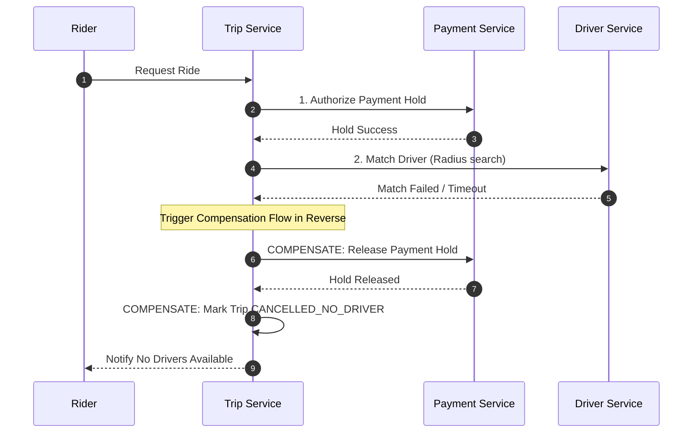

# Distributed Transactions — Orchestrated Saga Pattern

The **Trip Service** serves as the Saga Orchestrator for distributed trip transactions. Each execution step has an idempotent compensating action executed in reverse upon failure.

---

## Trip Lifecycle State Machine

```
   [REQUESTED] ──(Payment Hold OK)──► [MATCHING] ──(Driver Accepted)──► [ASSIGNED]
        │                                 │                                 │
 (Hold Failed)                     (No Driver Match)               (Trip Starts)
        ▼                                 ▼                                 ▼
[PAYMENT_FAILED]               [CANCELLED_NO_DRIVER]              [IN_PROGRESS]
                                                                            │
                                                                   (Destination Reached)
                                                                            ▼
                                                                       [COMPLETED]
```

---

## Saga Execution & Compensation Matrix

| Step # | Action | Forward Call | Service | Compensating Action | Trigger |
| :---: | :--- | :--- | :--- | :--- | :--- |
| **1** | Create Trip | Save `Trip` record (`PENDING`) | `Trip Service` | Soft-delete / Mark `CANCELLED` | Local failure |
| **2** | Authorize Payment Hold | `AuthorizeHold()` | `Payment Service` | Release Stripe Hold (`ReleaseHold()`) | Driver match fails or Rider cancels |
| **3** | Match & Dispatch Driver | `MatchDriver()` | `Driver Service` | Release driver back to `AVAILABLE` pool | Payment capture fails or Driver cancels |
| **4** | Confirm Trip Assignment | Update Trip (`ASSIGNED`) | `Trip Service` | N/A (Happy path complete) | Driver accepts match |

---

## Compensation Flow Sequence


