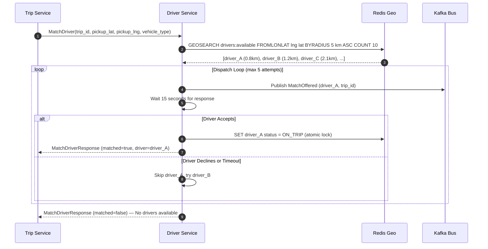

# Driver Service — Implementation Plan

## Overview

The Driver Service is the **matchmaking engine** for the cab booking platform. When a rider requests a trip, the Trip Service's Saga Orchestrator calls the Driver Service to find and dispatch the nearest available driver within a geographic radius.

This service must handle:
- **Driver profile management** (CRUD + status tracking)
- **Real-time geo-spatial indexing** via Redis Geo (`GEOADD` / `GEOSEARCH`)
- **The Dispatch Loop** — the core algorithm that finds nearest drivers, offers the ride one-by-one, waits for accept/decline with timeout, and falls back to next-nearest driver

---

## The Dispatch Loop — How It Actually Works

This is the single most complex piece of logic in the entire platform. Here's exactly how Uber and Bolt do it:

```
1. Rider requests a trip (Trip Service calls DriverService.MatchDriver via gRPC)
2. Driver Service queries Redis GEOSEARCH for nearest available drivers (sorted by distance)
3. Pick the closest driver → send them a ride offer via Kafka event
4. Start a 15-second countdown timer
5. IF driver ACCEPTS within 15s → return matched driver to Trip Service ✓
6. IF driver DECLINES or 15s timeout expires:
   a. Mark that driver as "skipped" for this trip
   b. Move to the NEXT nearest driver in the list
   c. Repeat from step 4
7. IF all nearby drivers exhausted (max 5 attempts) → return "no drivers available"
```



---

## Database Schema

### PostgreSQL — `drivers` Table

```sql
CREATE TABLE drivers (
    driver_id       UUID PRIMARY KEY DEFAULT gen_random_uuid(),
    name            TEXT NOT NULL,
    phone           TEXT NOT NULL UNIQUE,
    email           TEXT,
    status          TEXT NOT NULL DEFAULT 'OFFLINE',   -- OFFLINE | AVAILABLE | ON_TRIP
    vehicle_type    TEXT NOT NULL DEFAULT 'SEDAN',     -- SEDAN | SUV | PREMIUM | BIKE
    vehicle_plate   TEXT NOT NULL,
    vehicle_model   TEXT,
    rating          DOUBLE PRECISION NOT NULL DEFAULT 5.0,
    total_trips     INTEGER NOT NULL DEFAULT 0,
    created_at      TIMESTAMPTZ NOT NULL DEFAULT NOW(),
    updated_at      TIMESTAMPTZ NOT NULL DEFAULT NOW()
);
```

### Redis Geo — Live Driver Locations

Redis is the in-memory spatial index. The Location Service writes here, and Driver Service reads here.

```
Key:   drivers:available            ← Only AVAILABLE drivers in this geo set
Key:   drivers:on_trip              ← Drivers currently on a trip (removed from available set)
Cmd:   GEOADD drivers:available <lng> <lat> <driver_id>
Cmd:   GEOSEARCH drivers:available FROMLONLAT <lng> <lat> BYRADIUS 5 km ASC COUNT 10
```

---

## Package Structure

```
driver-service/
├── cmd/
│   └── main.go                  ← gRPC server bootstrap, dependency injection
├── migrations/
│   ├── 000001_create_drivers.up.sql
│   └── 000001_create_drivers.down.sql
├── internal/
│   ├── config/
│   │   └── config.go            ← Load env vars (Postgres DSN, Redis addr, Kafka brokers, ports)
│   ├── domain/
│   │   └── driver.go            ← Driver struct, DriverStatus enum, vehicle types
│   ├── repository/
│   │   └── driver_repo.go       ← Raw SQL: Create, GetByID, UpdateStatus, ListByStatus
│   ├── geo/
│   │   └── redis_geo.go         ← Redis Geo commands: AddDriverLocation, RemoveDriver, FindNearby
│   ├── dispatch/
│   │   └── loop.go              ← THE DISPATCH LOOP: find nearest → offer → wait → timeout → next
│   ├── kafka/
│   │   └── producer.go          ← Publishes MatchOffered, MatchAccepted, MatchDeclined events
│   └── handler/
│       └── driver_handler.go    ← gRPC handler: MatchDriver, UpdateDriverStatus, RegisterDriver, GetDriver
└── go.mod
```

---

## Core Components — Detailed Specification

### 1. `internal/domain/driver.go` — Domain Model

```go
type DriverStatus string

const (
    StatusOffline   DriverStatus = "OFFLINE"
    StatusAvailable DriverStatus = "AVAILABLE"
    StatusOnTrip    DriverStatus = "ON_TRIP"
)

type Driver struct {
    ID           string       
    Name         string       
    Phone        string       
    Email        string       
    Status       DriverStatus 
    VehicleType  string       // "SEDAN", "SUV", "PREMIUM", "BIKE"
    VehiclePlate string       
    VehicleModel string       
    Rating       float64      
    TotalTrips   int          
    CreatedAt    time.Time    
    UpdatedAt    time.Time    
}
```

### 2. `internal/geo/redis_geo.go` — Redis Geo Spatial Layer

This is the performance-critical module. All spatial operations run against Redis in-memory, not PostgreSQL.

| Method | Redis Command | Purpose |
| :--- | :--- | :--- |
| `AddDriverLocation(driverID, lat, lng)` | `GEOADD drivers:available <lng> <lat> <driver_id>` | Register/update driver's live position in geo index |
| `RemoveDriver(driverID)` | `ZREM drivers:available <driver_id>` | Remove driver from available pool (went offline or assigned to trip) |
| `FindNearbyDrivers(lat, lng, radiusKm, limit)` | `GEOSEARCH drivers:available FROMLONLAT <lng> <lat> BYRADIUS <r> km ASC COUNT <n>` | Find nearest available drivers sorted by distance ascending |
| `GetDriverLocation(driverID)` | `GEOPOS drivers:available <driver_id>` | Get current lat/lng of a specific driver |

### 3. `internal/dispatch/loop.go` — The Dispatch Loop Engine

This is the brain of the matchmaking system.

```
func (d *DispatchLoop) FindAndDispatchDriver(ctx, tripID, pickupLat, pickupLng, vehicleType) (*domain.Driver, error)

Configuration:
  - SEARCH_RADIUS_KM    = 5.0 km (initial search radius)
  - MAX_CANDIDATES      = 10   (max drivers to fetch from Redis per search)
  - MAX_DISPATCH_ATTEMPTS = 5  (max offers before giving up)
  - OFFER_TIMEOUT       = 15s  (wait time per driver offer)

Algorithm:
  1. Call geo.FindNearbyDrivers(pickupLat, pickupLng, 5km, 10)
  2. Filter candidates by vehicle_type (query PostgreSQL for vehicle metadata)
  3. For each candidate (closest first):
     a. Check driver still AVAILABLE in Redis (atomic read)
     b. Atomically set driver status to "DISPATCHING" using Redis SET with NX flag (distributed lock)
     c. Publish MatchOffered event to Kafka topic `driver.match.v1`
     d. Wait up to 15 seconds for MatchAccepted/MatchDeclined response
     e. If ACCEPTED:
        - Move driver from `drivers:available` to `drivers:on_trip` in Redis
        - Update driver status to ON_TRIP in PostgreSQL
        - Return matched driver
     f. If DECLINED or TIMEOUT:
        - Release the distributed lock (set status back to AVAILABLE)
        - Log attempt, continue to next candidate
  4. If all candidates exhausted, return error "no drivers available"
```

### 4. `internal/handler/driver_handler.go` — gRPC Handler

Implements `DriverServiceServer` from the proto definition:

| RPC Method | What It Does |
| :--- | :--- |
| `MatchDriver(MatchDriverRequest)` | Triggers the Dispatch Loop. Called by Trip Service Saga. |
| `UpdateDriverStatus(UpdateDriverStatusRequest)` | Driver goes online/offline. Updates PostgreSQL + Redis Geo index. |
| **New RPCs to add to proto:** | |
| `RegisterDriver(RegisterDriverRequest)` | Creates a new driver profile in PostgreSQL. |
| `GetDriver(GetDriverRequest)` | Fetches driver profile by ID. |

### 5. `internal/kafka/producer.go` — Kafka Match Events

Events published to `driver.match.v1` topic:

| Event | Payload | When |
| :--- | :--- | :--- |
| `MatchOffered` | `{ trip_id, driver_id, pickup_lat, pickup_lng, timestamp }` | Dispatch loop offers ride to a driver |
| `MatchAccepted` | `{ trip_id, driver_id, timestamp }` | Driver accepts the ride |
| `MatchDeclined` | `{ trip_id, driver_id, reason, timestamp }` | Driver declines or times out |
| `MatchExhausted` | `{ trip_id, attempts, timestamp }` | All candidates exhausted, no match |

---

## Proto Updates Required

The existing `driver.proto` needs two additional RPCs:

```protobuf
// Add to service DriverService:
rpc RegisterDriver(RegisterDriverRequest) returns (RegisterDriverResponse);
rpc GetDriver(GetDriverRequest) returns (GetDriverResponse);
```

---

## External Dependencies

| Package | Purpose |
| :--- | :--- |
| `github.com/redis/go-redis/v9` | Redis client with Geo command support (`GEOADD`, `GEOSEARCH`) |
| `github.com/jackc/pgx/v5` | PostgreSQL driver + connection pool |
| `github.com/golang-migrate/migrate/v4` | SQL migration runner |
| `github.com/twmb/franz-go` | Kafka producer for match events |
| `github.com/google/uuid` | UUID generation for driver IDs |
| `google.golang.org/grpc` | gRPC server framework |

---

## How This Integrates With Trip Service

The Trip Service Saga Orchestrator's step 3 calls `DriverService.MatchDriver()` via gRPC:

```
Trip Service Saga Step 3:
  → gRPC call: DriverService.MatchDriver(trip_id, pickup_lat, pickup_lng, "SEDAN")
  ← Response: { matched: true, driver_id: "abc-123", driver: { name: "Raj", rating: 4.8, ... } }
  
  IF matched == false:
    → Saga triggers compensation: release payment hold, cancel trip
```

---

## Verification Plan

### Build Verification
- `go build ./Services/driver-service/cmd/main.go` — must compile with zero errors
- `go vet ./Services/driver-service/...` — must pass

### Integration Testing (Manual)
1. Start PostgreSQL + Redis + Kafka via `make dev-up`
2. Run driver-service binary
3. Call `RegisterDriver` via grpcurl to create 3 test drivers
4. Call `UpdateDriverStatus` to mark drivers as AVAILABLE (triggers GEOADD to Redis)
5. Call `MatchDriver` with a pickup location near the test drivers
6. Verify dispatch loop logs show: candidate search → offer → timeout → next driver
7. Verify Kafka topic `driver.match.v1` receives events
8. Verify Redis `drivers:available` geo set has correct entries

---

## Open Design Decisions

> **NOTE**: For this initial implementation, the dispatch loop will use a **synchronous wait with Go channel + timer** to simulate waiting for driver acceptance. In production, this would be replaced by a Kafka consumer listening for `MatchAccepted` events from the driver's mobile app via Centrifugo WebSocket. We'll wire that up when we build the Notification Service.
